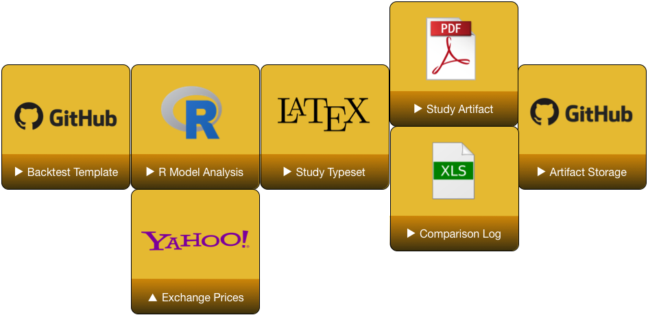

# Introduction

## Motivation

* Recap experience for backtesting trading models
* Offer ideas for automation and configuration management

# Trading Simulation

## Tool Chain

1. Manage Data
1. Evaluate Data
1. Determine Trades
1. Size Trades
1. Calculate Performance
1. Analyze Performance

## Data Sources

* Fetch historical data by ticker
* Check for ticker and exchange swaps
    - Most efficiently use _latest_ universe of GGCM ETFs
* Adjust OHLC for dividends and splits

## Strategy and Rules

* Indicators
    - Derived from market data, path-independent
* Signals
    - Interaction between market data and indicators
    - Desire for action, but may not be actionable
* Rules
    - Path-dependent action on signals
    - Aware of current positions and time
    - Computation of order size
    - Position limits
    - Periodic rebalancing
    - Entry, exit and risk-management orders

## Blotter Bookkeeping

* Order posts, fills, and cancels
* Commissions and ticket charges
* Cash balance tracking
* "Mark the book" with current holdings and prices
* Periodic portfolio equity determination for rebalancing

## Orders

* Our strategies work on months
* Stops tested on $m$ minute periods
* Order chains: parent fill triggers set of follow-up OCO orders

## Preprocessing

* Adjusting OHLC historical prices for splits and dividends
* Cleaning zeros and NAs
* Accounting for exchange moves

# Automation

## Model Backtest Flow

## Model Update Flow

## Change Management

# Backup

## References

* None

