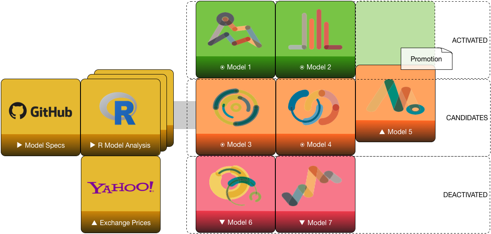
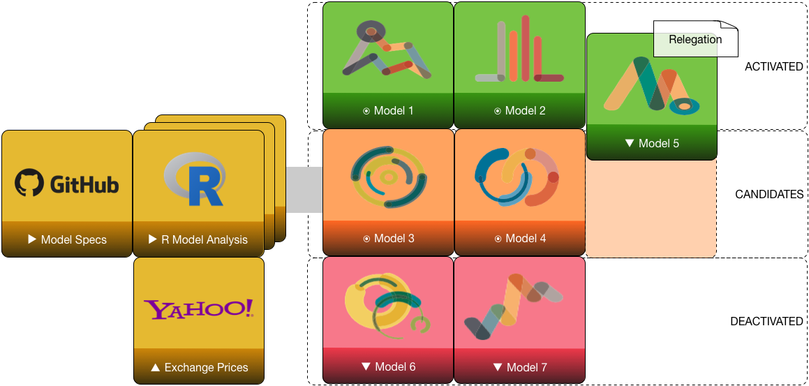
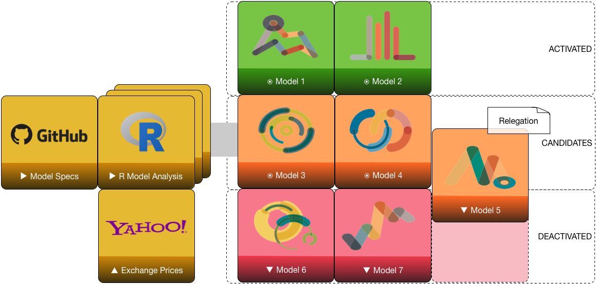
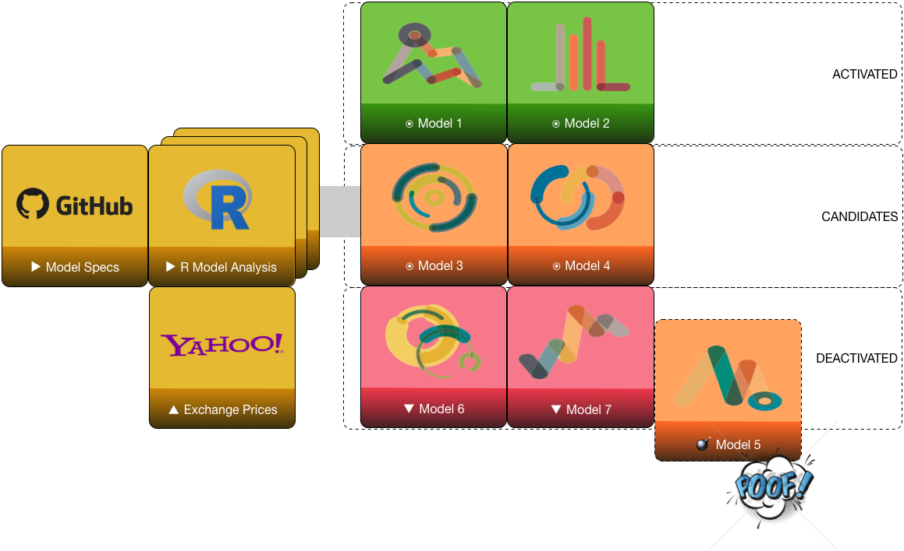

# Introduction

## Syopsis

We have several models backtested and validated, but we have money invested
in only a few of them.  Each month, how do we decide which models to
activate or deactivate?    

## Motivation

- We soon will have several candidate models validated and backtested.
- To facilitate operation, model activation or deactivation should be an objective, repeatable, and reproducible analysis.
- Some models that backtested well will under-perform under real market and trading conditions; how to dispassionately deactivate them? 

## Portfolio Selection

Give model candidates, which to choose? 

- Use _Markowitz selection_? (the bullet model)
- Use _risk parity_, risk on when market volatility declines? 
- Use _accumulating size_, incrementally adding to winning positions? 

# Competition

## Metrics

* CAGR percentage, monthly returns
* Maximum drawdown MDD magnitude percentage, any peak to trough
* Sortino ratio, $S = (R-T) / D_R$, excess return over downside deviation
* Calmar ratio, $C = CAGR / MDD$, monthly with 36-month lookback

## Performance Tracking

* Compute actual metric values for all activated models
* Compute out-of-sample metric values for all other models
* Track in performance book
    + Actual vs. in-sample expected metrics
    + Out-of-sample vs. in-sample expected metrics

## Activation

* _Activation_ refers to placing a model into portfolio; it becomes investable but may have zero weighting
* _Deactivation_ refers to removing a model from portfolio, moving from activated tier to candidate tier; it continues tracking but is not invested

----

## Relegation and Promotion

----

Model promotion from candidate to activated

----

Model relegation from activated to candidate

----

Model relegation from candidate to deactivated

----

Model retirement

# Recommendation

## High-Level Procedure

* Monthly assessment of activated models
* Monthly assessment of candidate models
* Monthly assessment of deactivated models
* Decision to promote, relegate or retire models
* Decision of allocation across activated models and cash

## Recommendation

* Scorecard running six-month scores for each model
    * CAGR rank, Sortino Ratio rank, Calmar Ratio rank
    * $\sigma^2_\mathrm{SR}$ deviation from backtest
* Select top $N$ models for activation, weighted by Calmar Ratio
* Within each mnodel, weight funds by model-specific method

## References

* None
