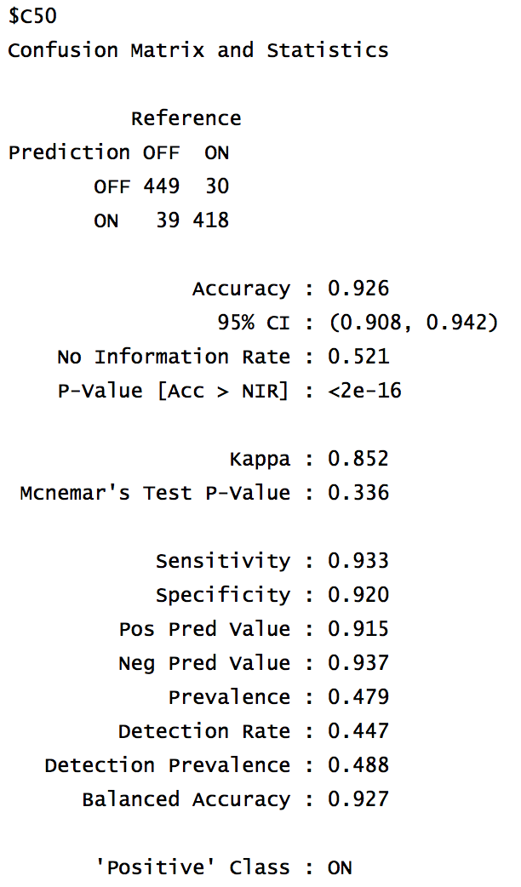
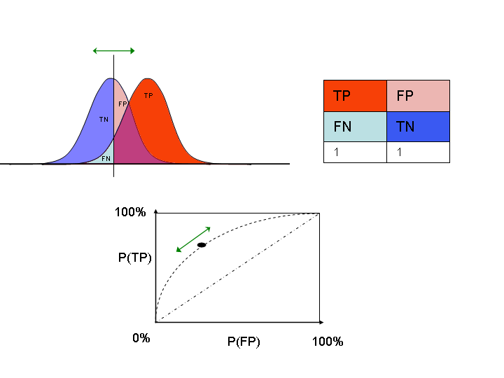
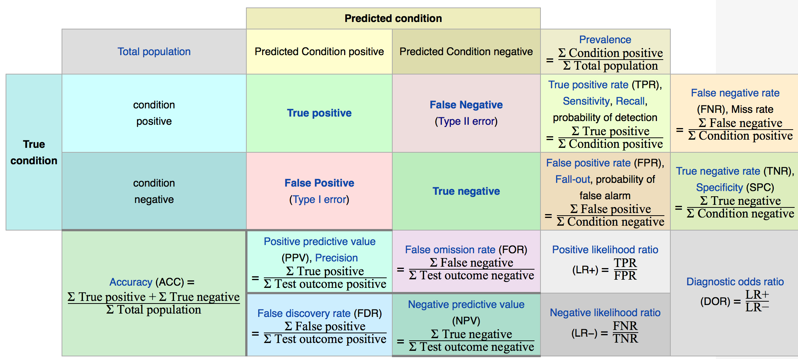
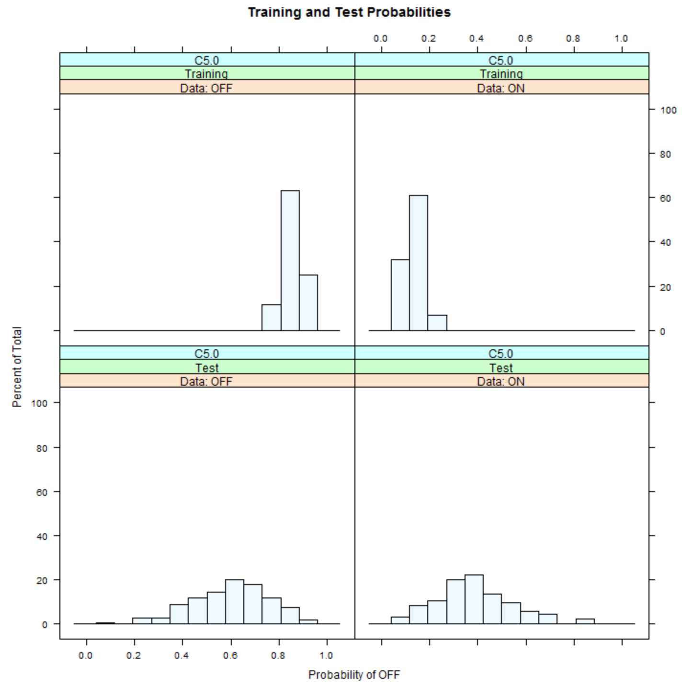
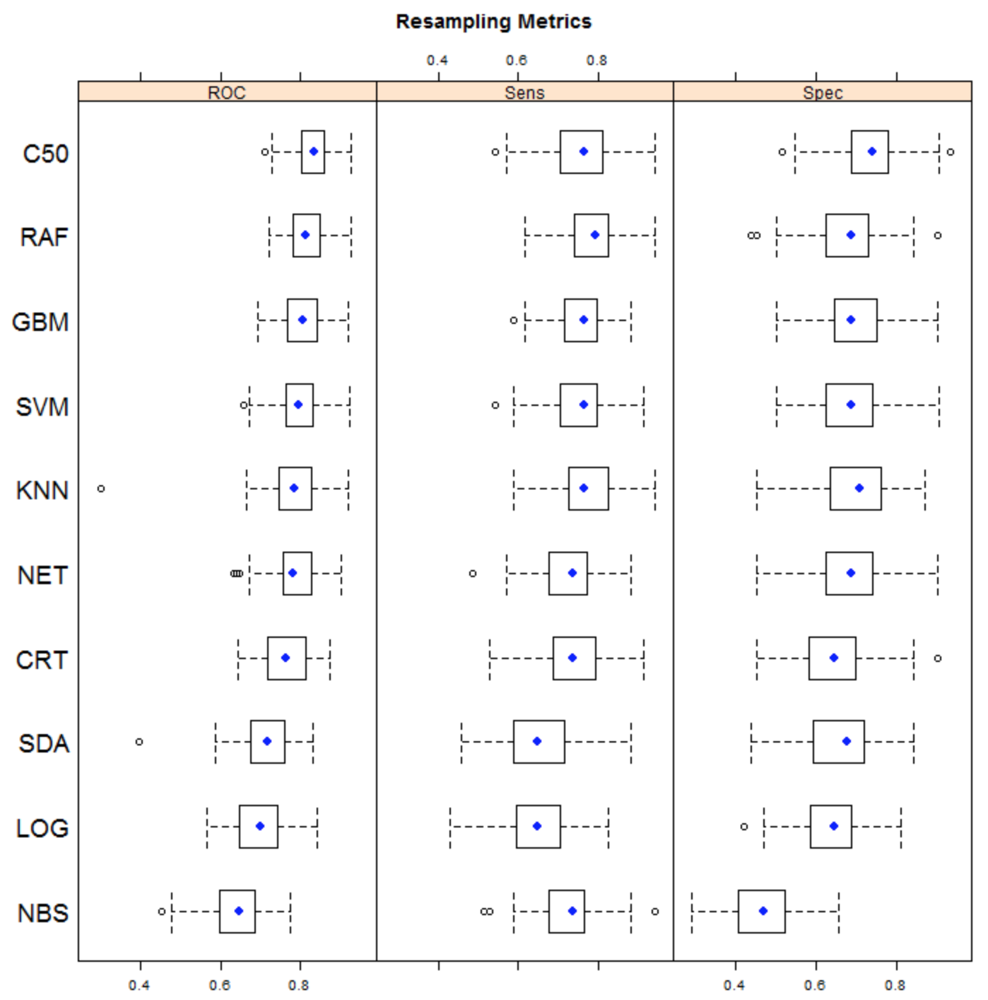
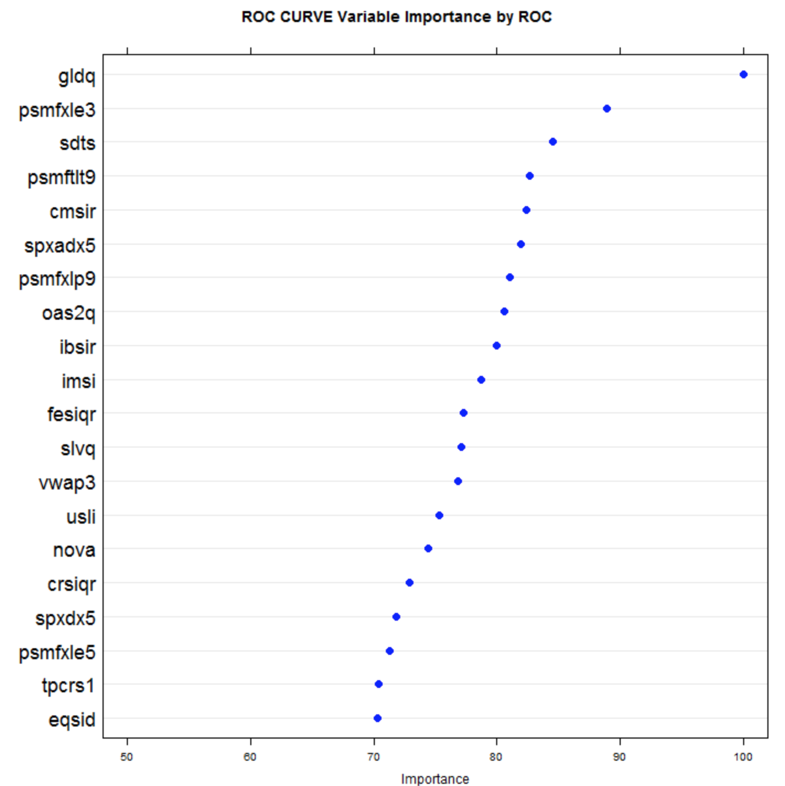
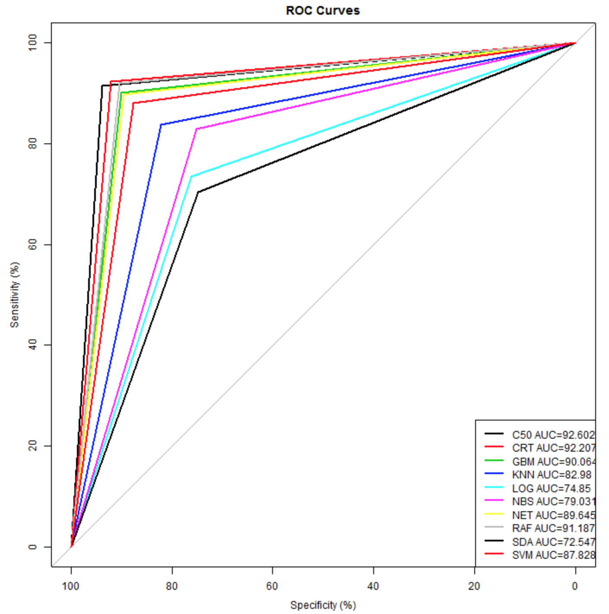
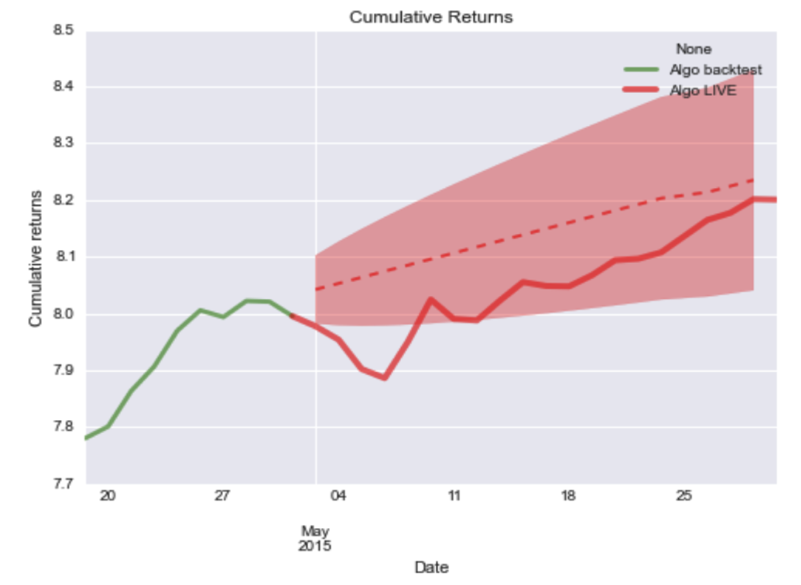

# Introduction

## Motivation

- Provide guidance for evaluating backtests
- Characterize backtest overfit risk
- Identify quantitative methods for evaluating model performance

## Motivation

"When an investor receives a promising backtest from a researcher or portfolio manager, one of her key problems is to assess how realistic that simulation is. This is because, given any financial series, it is relatively simple to overfit an investment strategy so that it performs well [in sample]." _Bailey et al._

# Formulation

## Backtest Length

For a set of $N$ model configurations, each with IID performance, the developer finds an "optimal" strategy with an IS annualized Sharpe Ratio (SR) over $y$ years of 

$$
E[\mathit{max}_N ] \approx y^{-1/2} \left( (1-\gamma)Z^{-1} \left[1-\frac{1}{N} \right] + \gamma Z^{-1} \left[1-\frac{1}{N}e^{-1}\right]\right) 
$$

where $\gamma$ is the Euler-Mascheroni constant, $Z$ is the CDF of the Gaussian normal, and $e$ is Euler's number. 

## Backtest Length

Then the Minimum Backtest Length (MinBTL, in years) needed to avoid selecting a strategy with an IS SR of $\overline{E[\mathit{max}_N]}$ among $N$ strategies with an expected OOS SR of zero is 

$$
\mathit{MinBTL} \approx \left( \frac{(1-\gamma)Z^{-1} [1-\frac{1}{N} ] + \gamma Z^{-1} [1-\frac{1}{N}e^{-1}]}{\overline{E[\mathit{max}_N]}} \right)^2
$$
$$
\mathit{MinBTL} < \frac{2Ln[N]}{\overline{E[\mathit{max}_N]^2}}
$$

So, given $N$ trials (model configurations) and target SR, use this to compute minimum history length.

## Backtest Length

* With just $N=7$ model configurations, already 2 years of data are required to achieve $SR_{IS}=1$, $SR_{OOS}=0$.  Additional years of data are required to increase $SR_{OOS} > 0$ without increasing $N$. 
* With $y=5$ years of history, only $N=45$ model configurations can be used to achieve $SR_{IS}=1$, $SR_{OOS}=0$.  

## Stochastic Memory

When a process has "memory", trend, or auto-regressive behaviors, and your backtested model has optimized-away that degree of freedom, then an overfitted IS model leads quickly to degraded OOS performance.  

_Most financial processes exhibit some sort of process memory in the form of economic cycles, mean reversion, etc.  The consequence of over-fitting is thus negative performance out-of-sample._

# Assessment

## Performance

Fitness might be determined over entire simulation by:

* CAGR
* Max drawdown
* Calmar ratio

Or, on a trade-level basis:

* Winning trade count, losing trade count
* Average profit winning trades, average loss losing trades
* Average drawdown percentage

## Prediction Model Stats

## Prediction Model Performance

## Performance Descriptions

## OOS Degradation

## Model Performance Comparison

## The ROC Curve

## Model ROC Importance

## Model ROC Curve Overlay

## Model OOS Prediction Cone

# Recommendation

## Recommendation

* Formulate ROC approach on win/loss profit factors
* Apply minimum backtest length considerations
* Apply CAGR and Calmar for minimum filter constraints
* _Develop tax consideration overlay_

# Backup

## References

* Bailey, Borwein, L$\'{o}$pez de Prado, and Zhu, "Pseudo-Mathematics and Financial Charlatanism: The Effects of Backtest Overfitting on Out-of-Sample Performance", SSRN, 2013. 
* L$\'{o}$pez de Prado, "What to Look for in a Backtest", LBNL, 2013. 
* Wikipedia [Receiver Operating Characteristic](https://en.wikipedia.org/wiki/Receiver_operating_characteristic)

