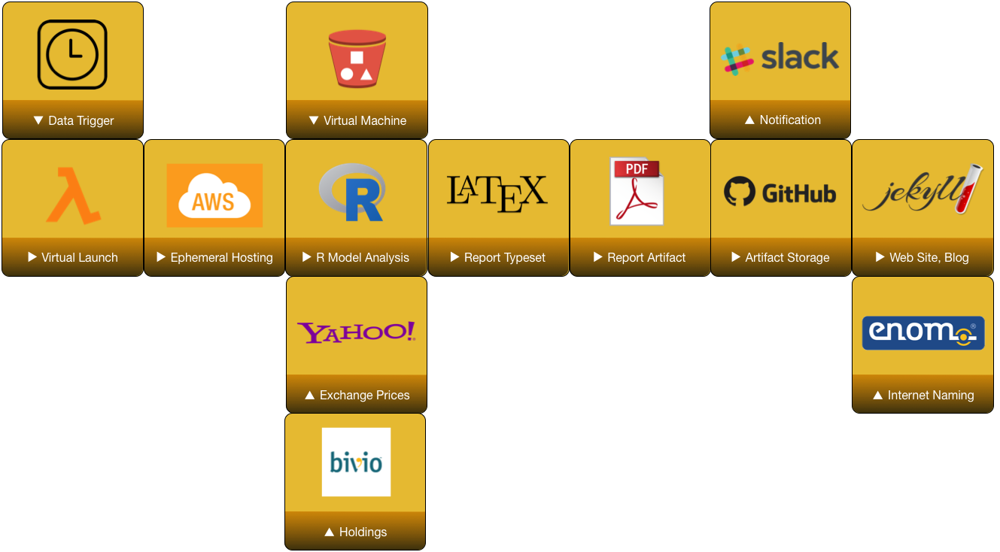
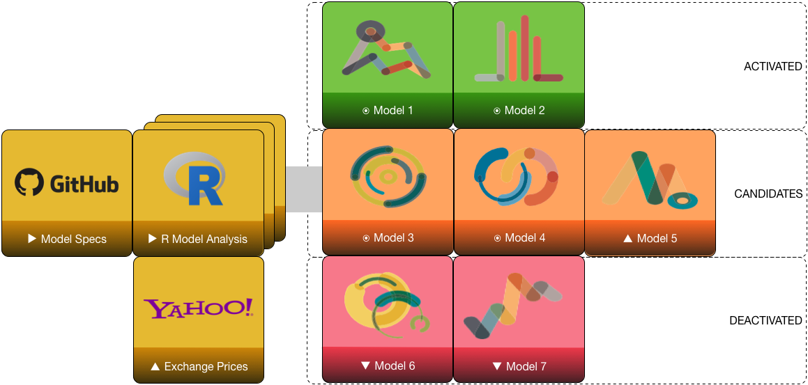

# Introduction

Introduction to charts

## Motivation

- Provide guidance for backtesting trading models
- Illustrate parameter search and optimization
- Identify overfitting risk
- Results comparison and configuration management

# Optimization

Optimization setup

## Parameter Search

- Distributions, combinations
- Dynamic Range

----


Multiple parameter search yields rough optimization surface.


## Expectation

- Local vs. Global Optimization
- Robust Solutions

# Trading Simulation

Trading simulation

## Tool Chain

1. Manage Data
1. Evaluate Data
1. Determine Trades
1. Size Trades
1. Calculate Performance
1. Analyze Performance

## Data Sources

- Fetch historical data by ticker
- Check for ticker and exchange swaps
-- Perhaps only use *latest* universe of GGCM ETFs
- Adjust OHLC for dividends and splits


## Strategy and Rules

- Indicators
-- Derived from market data, path-independent
- Signals
-- Interaction between market data and indicators
-- Desire for action, but may not be actionable
- Rules
-- Path-dependent action on signals
-- Aware of current positions and time
-- Computation of order size
-- Position limits
-- Periodic rebalancing
-- Entry, exit and risk-management orders

## Exchange Interaction

- Market hours open, close


## Blotter Bookkeeping

- Order posts, fills, and cancels
- "Mark the book" with current holdings and prices

## Orders

- Our strategies work on months
- Our stops work on minutes or hours
- Order chains: parent fill triggers set of follow-up OCO orders

## Preprocessing

- Adjusting splits and dividends
- Cleaning zeros and NAs
- Accounting for exchange moves

## Calculations: Trend Indicators and Ranks

- Trend up: $X_t > X_{t-5} > X_{t-10} > X_{t-20}$
- Trend down: $X_t < X_{t-5} < X_{t-10} < X_{t-20}$
- Gearing: 120-day correlation with SPX
- Rank $R$: ordered ranking within group
- Weighted Rank \%: $(3R_S + 2R_I + 1R_L)/(6(N-1))$


## Calculations: Rank Position

```{r echo=FALSE,message=FALSE,warning=FALSE}
require(lattice,quietly=TRUE)

myf <- function(y,title) {
  color="blue"
  labs = c("Short","Intermediate","Long")
  x = c(1,2,3)
  plot(x,y,xaxt="n",main=title,col=color,lwd=2,ylim=c(0,5),type='b',frame.plot=FALSE,axes=FALSE,ylab="Rank",xlab="")
  axis(side=1,at=x,pos=0,labels=labs)
}

par(mfrow=c(2,3))
myf(c(4,2,1),"Rank Position 3")
myf(c(3,3,1),"Rank Position 2")
myf(c(3,4,1),"Rank Position 1")
myf(c(1,3,4),"Rank Position -3")
myf(c(2,4,4),"Rank Position -2")
myf(c(1,4,3),"Rank Position -1")
par(mfrow=c(1,1))

```

## Model Backtest Flow


## Model Update Flow




## Model Competition

* Monthly assessment of invested models
* Monthly assessment of candidate models
* Decision to relegate or promote models
* Decision to weight allocation equally or by performance 

----




# Backup

## References


- Antonacci, "Dual Momentum Investing", 2015
- Gray and Vogel, "Quantitative Momentum", 2016
- Hochreiter, "Financial Portfolio Optimization with (O)R", 2013
- Humme and Peterson, "Using Quantstrat Tutorial", 2013


