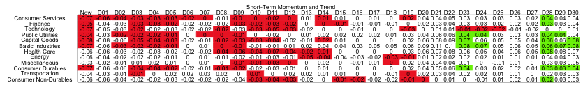

<!-- no captions -->

# Introduction


## Motivation

- Provide guidance for backtesting trading models
- Illustrate parameter search and optimization
- Identify overfitting risk
- Results comparison and configuration management

# Optimization

## Parameter Search

# Trading Simulation

## Data Sources

- Fetch historical data by ticker
- Check for ticker and exchange swaps
-- Perhaps only use *latest* universe of GGCM ETFs
- Adjust OHLC for dividends and splits


## Strategy and Rules

## Exchange Interaction

## Blotter Bookkeeping

## Stops

- Our strategies work on months
- Our stops work on minutes or hours

## Preprocessing


## Calculations: Trend Indicators and Ranks

- Trend up: $X_t > X_{t-5} > X_{t-10} > X_{t-20}$
- Trend down: $X_t < X_{t-5} < X_{t-10} < X_{t-20}$
- Gearing: 120-day correlation with SPX
- Rank $R$: ordered ranking within group
- Weighted Rank \%: $(3R_S + 2R_I + 1R_L)/(6(N-1))$


## Calculations: Rank Position

```{r echo=FALSE,message=FALSE,warning=FALSE}
require(lattice,quietly=TRUE)

myf <- function(y,title) {
  color="blue"
  labs = c("Short","Intermediate","Long")
  x = c(1,2,3)
  plot(x,y,xaxt="n",main=title,col=color,lwd=2,ylim=c(0,5),type='b',frame.plot=FALSE,axes=FALSE,ylab="Rank",xlab="")
  axis(side=1,at=x,pos=0,labels=labs)
}

par(mfrow=c(2,3))
myf(c(4,2,1),"Rank Position 3")
myf(c(3,3,1),"Rank Position 2")
myf(c(3,4,1),"Rank Position 1")
myf(c(1,3,4),"Rank Position -3")
myf(c(2,4,4),"Rank Position -2")
myf(c(1,4,3),"Rank Position -1")
par(mfrow=c(1,1))

```


# Trend Figures

## NASDAQ Industry



NASDAQ industries trend, left-hand side is today, right-hand side is 30 days ago.  Trend shown is short-term momentum value; other trends provided are PSMF, intermediate-term momentum, and long-term momentum.  Color is tied to the momentum trend indicator value (up or down).  

----


