# Introduction

## Motivation

- Premise: industry group relative performance is cyclical
- Tactic: put new money to work in an industry group out-performing other groups
- Tactic: inform portfolio allocation and buy/sell decisions

## Approach

- Use Industry Classification Benchmark assignments provided by exchanges
- Use *every stock* in each ICB group, daily close price and volume
- Compute performance of these groups and their roll-ups
- ICB tiers: Industry, Supersector, Sector, Sector

## Exchanges

- NYSE provides a full ICB map
- NASDAQ provides flatter ICB, only two tiers
- MRB conjured two maps for MLPs and real estate
- We download maps automatically for each analysis run

## Preprocessing

- Toss stocks no longer trading
- Fill in stale NYSE map with stocks now trading on NASDAQ
- Toss stocks with less than 1yr history
- Toss stocks with missing recent history
- Toss NASADQ stocks < \$5
- Compute split-adjusted close prices

## Calculations

- Time frames: short=20d, intermediate=60d, long=120d
- Group prices: average of every stock's price in that group
- Group volumes: average of every stock's volume in that group
- Momentum: continuous method (log) price rate of change
- Money flow: volume-weighted price over past 20d (Chaikin algorithm)
- Persistency: percent of days over past 125d money flow > 0
- Hi-Lo: new high or low price over 13, 26 or 52 weeks
- Return: one-day price ratio in percent
- Advance/decline: up or down over time frame

## Calculations: Trend Indicators and Ranks

- Trend up: $X_t > X_{t-5} > X_{t-10} > X_{t-20}$
- Trend down: $X_t < X_{t-5} < X_{t-10} < X_{t-20}$
- Gearing: 120-day correlation with SPX
- Rank $R$: ordered ranking within group
- Weighted Rank \%: $(3R_S + 2R_I + 1R_L)/(6(N-1))$

## Calculations: Rank Position

Curvature rules, where $R$ smaller rank value is higher performance:

- 3: $R_S < R_I \land R_S < R_L \land R_L > R_S \land R_L > R_I$
- 2: $R_S \leq R_I \land R_S \leq R_L \land R_L \geq R_S \land R_L \geq R_I$
- 1: $(R_I < R_S \land R_I < R_L) \lor (R_I > R_S \land R_I > R_L) \land R_S < R_L$
- 0: $R_S = R_I = R_L$
- -1: $(R_I < R_S \land R_I < R_L) \lor (R_I > R_S \land R_I > R_L) \land R_S > R_L$
- -2: $R_L \leq R_S \land R_L \leq R_I \land R_S \geq R_I \land R_S \geq R_L$
- -3: $R_L < R_S \land R_L < R_I \land R_S > R_I \land R_S > R_L$

## Calculations: Rank Position

```{r echo=FALSE,message=FALSE,warning=FALSE}
require(lattice,quietly=TRUE)

myf <- function(y,title) {
  color="blue"
  labs = c("Short","Intermediate","Long")
  x = c(1,2,3)
  plot(x,y,xaxt="n",main=title,col=color,lwd=2,ylim=c(0,5),type='b',frame.plot=FALSE,axes=FALSE,ylab="Rank",xlab="")
  axis(side=1,at=x,pos=0,labels=labs)
}

par(mfrow=c(2,3))
myf(c(4,2,1),"Rank Position 3")
myf(c(3,3,1),"Rank Position 2")
myf(c(3,4,1),"Rank Position 1")
myf(c(1,3,4),"Rank Position -3")
myf(c(2,4,4),"Rank Position -2")
myf(c(1,4,3),"Rank Position -1")
par(mfrow=c(1,1))

```

# Rank Figures

## Figure Groups

- NYSE rankings by industry, super-sector, sector and sub-sector
- NASDAQ rankings by industry, sector
- Special rankings by sector

## NYSE Industry

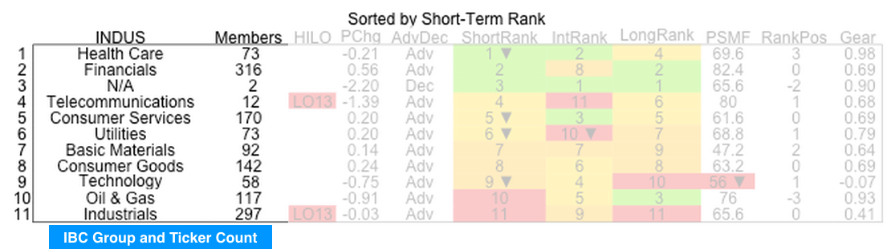

## NYSE Industry

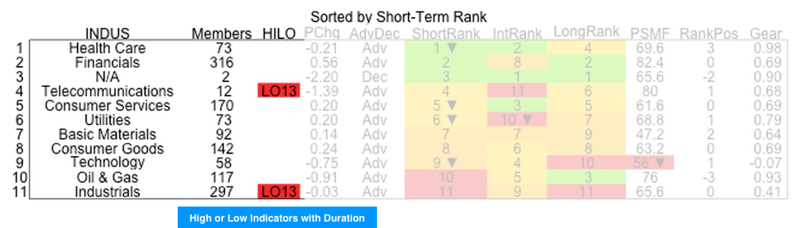

## NYSE Industry

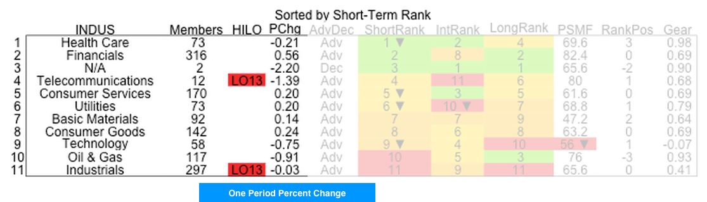

## NYSE Industry

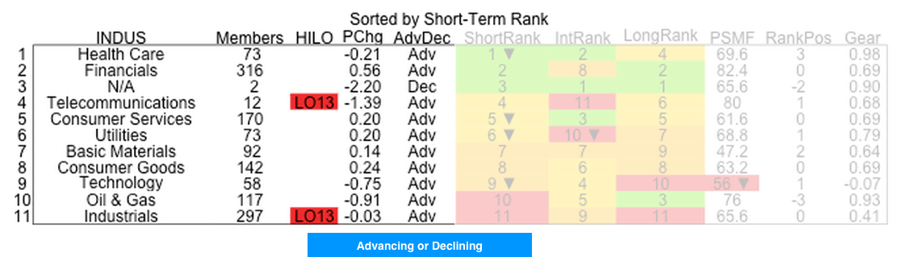

## NYSE Industry

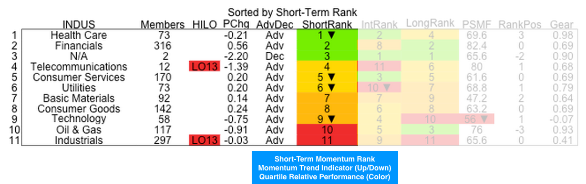

## NYSE Industry

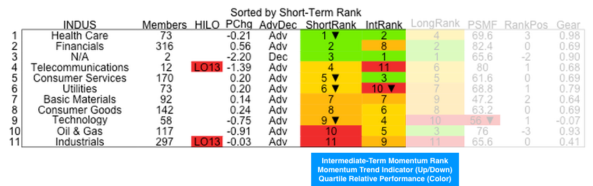

## NYSE Industry

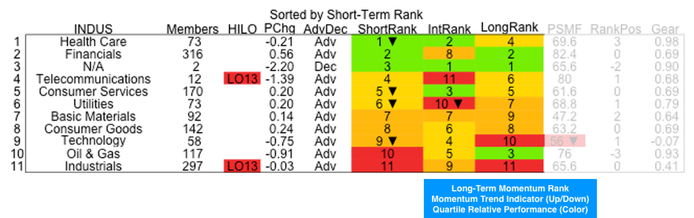

## NYSE Industry

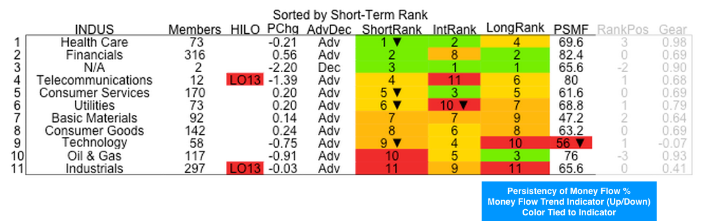

## NYSE Industry

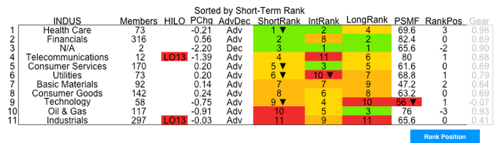

## NYSE Industry

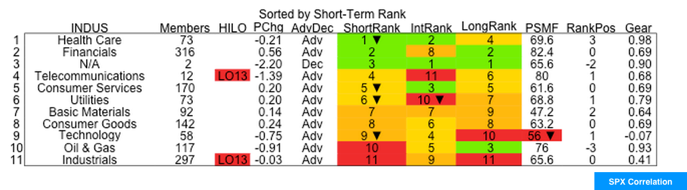


# Trend Figures

## Figure Groups

- NYSE trends by industry, super-sector, sector and sub-sector
- NASDAQ trends by industry, sector

## NASDAQ Industry


NASDAQ industries trend, left-hand side is today, right-hand side is 30 days ago.  Trend shown is short-term momentum value; other trends provided are PSMF, intermediate-term momentum, and long-term momentum.  Color is tied to the momentum trend indicator value (up or down).  

## NASDAQ Industry

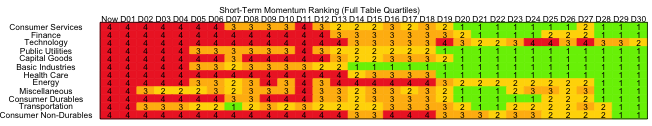

NASDAQ industries trend, left-hand side is today, right-hand side is 30 days ago.  All of the table values are considered in forming quartiles for coloring.  Quartile values and colors then indicate relative value over time, not up or down performance.  

## NASDAQ Industry

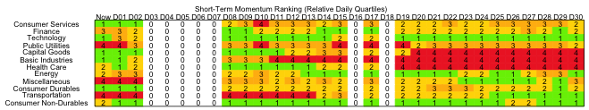

NASDAQ industries trend, left-hand side is today, right-hand side is 30 days ago.  Only daily values are considered in forming quartiles for coloring.  Quartile values and colors then indicate relative value for the day, not up or down performance.  If daily values are too close to form quartiles we show zeros. 

# Notes

## Notes Section

- Tickers included or excluded in analyses
- ICB reference


