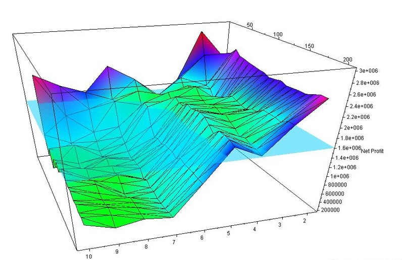
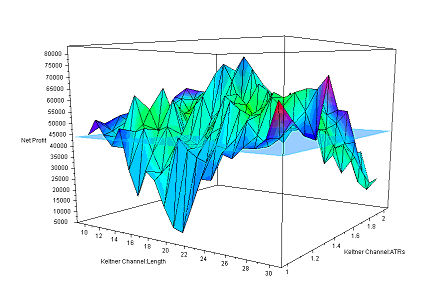

# Introduction

## Motivation

* Discuss model design parameter search issues

# Model Optimization

## Parameter Search

* Model parameter distributions and combinations imply search space
* Search procedure may find local or global extrema
* We presumably want solutions robust to small excursions in parameter values

Elsewhere we discuss the issues with model combinations, sufficient history, and expected performance parameters w.r.t. overfitting.

## Search Surface

\small An example of multiple parameter search result surface.  Which parameter pair would you choose as a model solution?

## Search Surface

\small Another example of multiple parameter search result surface.  Parameter selection more difficult owing to steeper penalties. 

## Joint Metric Surface Evaluation

\small Ranking several performance metrics may expose a region of closely-related cases (robust selection).

## Joint Metric Subset

\small Zooming-in to ranked performance measures for case selection.

## Joint Metric Subset

\small Same model, same region, alternative performance measures consideration.

## Heat Map Visualization

\small MACD parameter visualization with regional cases identified. 

# Recommendation

## Recommendation

* Evaluate your backtests for robust parameter selection.  If a moving average lookback is off by one day, does the model become a debacle?  
* Sacrifice a global optimum in favor of a local optimum when the latter has a broad region of good performance robust to small perturbations in the parameter vaules.
* Document your rationale so that your successors, who presumably will uncover the same extrema, can follow your decisions. 

