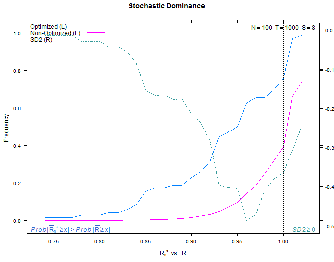

# Introduction

## Motivation

- _Minimum backtest length_ computations seek to compute a duration required to achieve a trading model confidence level, yet also show that more parameter selections is not necessarily better.  
- Together with _combinatorially symmetric cross validation_ we can use in-sample and out-of-sample tests to compute expectations for model performance and compute a probability that a backtest has been overfitted.
- The same analysis can predict model performance degradation and stochastic dominance levels. 

## Formulation

We see that $n^*$ is the strategy number with optimal performance $R$ IS.  Thus $R_{n^*} \geq R_n, \forall n = 1,\ldots, N$, so the performance of the $n^*$ strategy on the OOS data is $\overline{R_{n^*}}$. If the median performance of all strategies OOS is $\mathit{Me}[\overline{R}]$ then the strategy selection process overfits when a strategy $n^*$ with the highest rank IS exhibits
\begin{equation}
E[\overline{R_{n^*}}] < \mathit{Me}[\overline{R}]
\end{equation}
Owing to the independent performance evaluation there is a non-null probability that the $n^*$ strategy IS underperforms the median strategy OOS. The probability that the selected strategy $n^*$ is overfit is the PBO definition:
\begin{equation}
\mathit{PBO} \equiv \mathit{Prob} \bigl[ \overline{R_{n^*}} < \mathit{Me} [ \bar{R} ] \bigr]
\end{equation}

---- 

Note that this process-based definition does not depend on the strategy's underlying models or performance evaluation measure.  If the backtest is helpful then the optimal strategy $n^*$ selected IS should outperform most of the $N$ trials OOS, such that $\lambda_c > 0$.  Using the frequency distribution then we estimate the PBO value as
\begin{equation}
\phi = \int_{-\infty}^{0} f[\lambda] \: d\lambda
\end{equation}
which represents the rate at which the optimal IS strategies underperform the median of the OOS trials.  When $\phi \approx 0$ there is no significant overfitting because the optimal IS strategy improved performance OOS.  When $\phi = 1/2$ the optimal IS strategy outperformed in as many trials as it outperformed, so the backtest added no value.  When $\phi \gg 1/2$ the backtest leads to worse performance than choosing a strategy at random.

## Selection Statistics

How many times during CSCV is an IS case selected as best?

----

How many times during CSCV is an IS case selected as best (larger)?

----

Which best OOS case is selected for the best IS case selection? 

----

CSCV results IS and OS surface.

----

Seeded case OOS rank discovery.

# Examples

## Case 1 Overfit

----

----

## Case 2 Borderline

----

----

## Case 3 Not Overfit

----

----

# Backup

## References

* Barry, "Package *pbo*: Probability of Backtest Overfitting", R/Finance, 2014.
* Bailey, Borwein, L$\'{o}$pez de Prado, and Zhu, "The Probability of Back-Test Overfitting", SSRN, 2013.
* Bailey, Borwein, L$\'{o}$pez de Prado, and Zhu, "Pseudo-Mathematics and Financial Charlatanism: The Effects of Backtest Overfitting on Out-of-Sample Performance", SSRN, 2013. 

