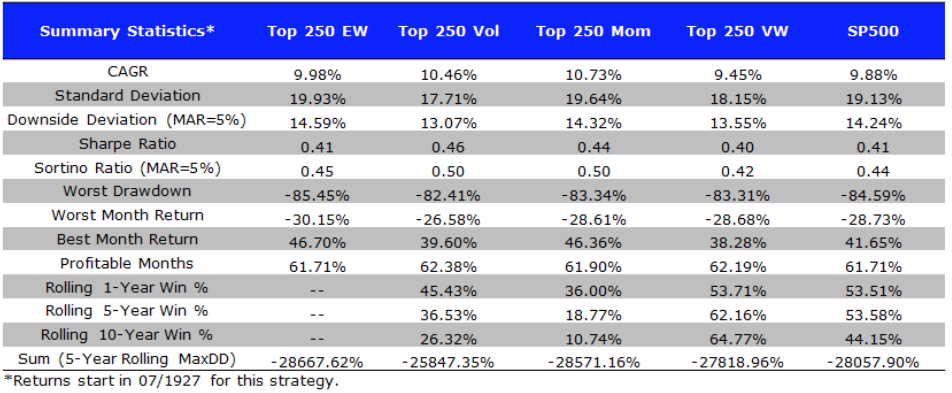
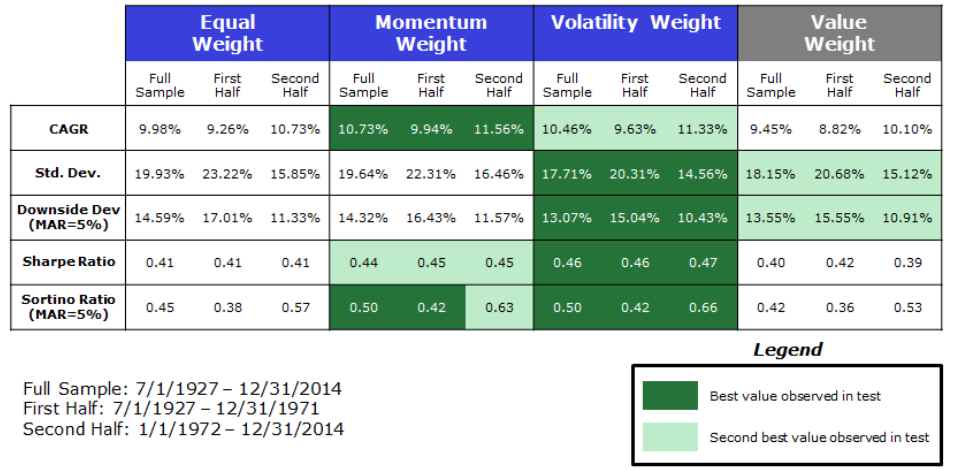
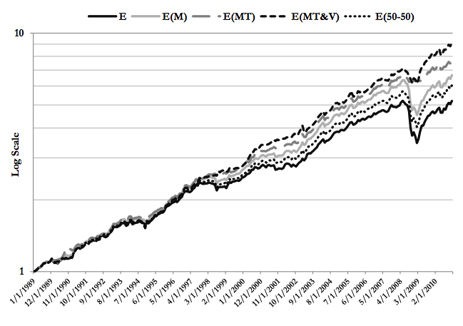
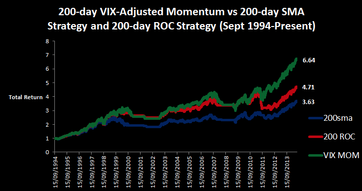
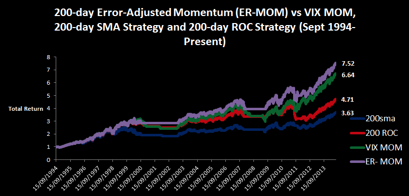
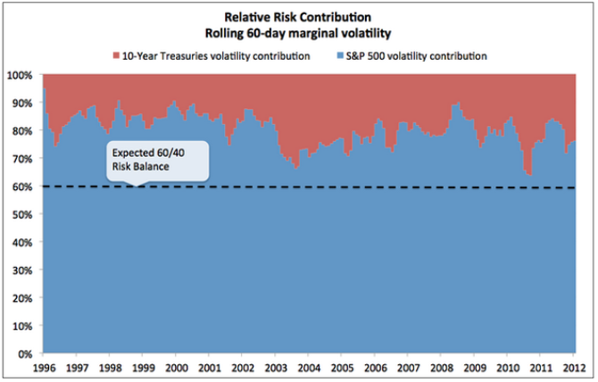
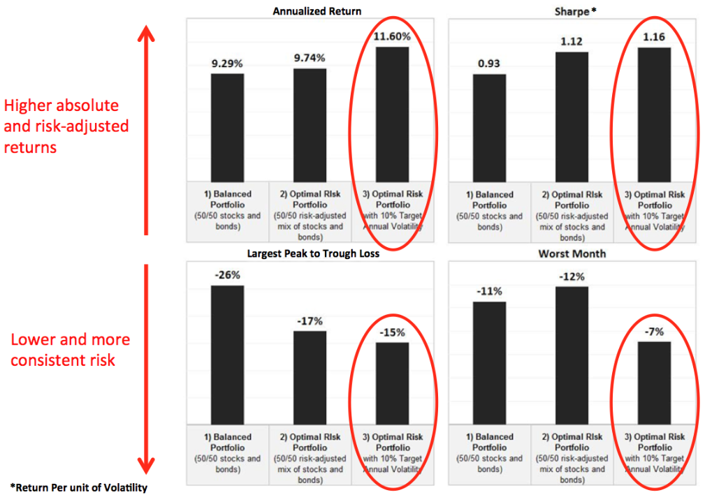

# Introduction

## Position Size

- After selecting funds for entry, how much to buy?
- Position size may be equal-weighted by default
- Position size determination may be sophisticated

## Synopsis

Given a decision to apply funds $F$ to a model $M$ with universe $U$,
based on model signals $A$, use model measures $B$ to determine the 
weight $w_i$ of each ETF $u_i \in U$ for allocation. 

## Importance

With most trend-following strategies, taking a larger position during periods of more ``confidence,'' and likewise a smaller position during periods of less confidence, typically results in higher CAGR and smaller drawdowns.  

- Confidence estimated in different ways

## Importance

\small ``Over the entire time period, volatility and momentum weighting have the highest performance.''

\small ``Equal-weighting, volatility-weighting techniques and momentum-weighting all beat the standard value-weighting technique.''

----

250-stock universe model results (Vogel)

# Volatility Methods

## Volatility-Adjusted Momentum

- Actual (lagged) volatility based on own observations
- "Weighting a strategy with its own volatility seems to work at least when the relationship with volatility is negative and using normalized returns is almost always effective."
- "Dispersion weighting... [is] less effective, though still improving the Sharpe ratio."

## Z-Score Momentum Value

- Actual (lagged) volatility based on own observations
- Compute weight according to Z-score allocated across holdings
- Enables standardized comparison across asset classes. 
- "In the combined tactical asset allocation model, this modification adds value by adjusting the importance of value and momentum strategies under different market conditions"

----

# Alternative

## VIX-Adjusted Momentum

- Implied (predicted) volatility based on options market
- Adjust the indicator from which signal is used, dividing price return by VIX before computing SMA, ROC, or other momentum value
- Long when VIX-adjusted momentum > 0, cash otherwise
- Most appropriate for equity funds

----

## Error-Adjusted Momentum

- Like VIX-Adjusted Momentum, but applicable to any asset class
- Error-adjusted value based on moving average
- Adjust the indicator from which signal is used, dividing price return by EAM before computing SMA, ROC, or other momentum value
- Long when Error-adjusted momentum > 0, cash otherwise

----

## Risk-Weighted Signals

- An alternative to computing position size after taking the signals is to weight the signals themselves before acting upon them.  
- Consider _risk-weighted signals_ as in Baltas.  

# Recommendations

## Recommendations

1. Consider periodic equal-weight rebalancing for all models.
1. Consider position sizes for models having natural analytic associations.
1. Do not force-fit position sizing where it is unnatural.
1. Build and backtest an error-adjusted momentum model.

----

Relative risk contribution, 60/40 stocks/treasury portfolio.

----

Return and risk characteristic, risk-managed portfolios.

# Backup

## Reference

- Baltas and Koslwski, "Improving Time-Series Momentum Strategies: The Role of Volatility Estimators and Trading Signals", 2012.
- Butler et al., "Adaptive Asset Allocation: A Primer", 2012.
- du Plessis and Hallerbach, "Volatility Weighting Applied to Momentum Strategies", 2015.
- Varadi, "Error-Adjusted Momentum", 2014.
- Varadi, "VIX-Adjusted Momentum", 2014.
- Vogle, "Which Asset Allocation Weights Work the Best", 2015.
- Wang and Kochard, "Using a Z-Score Approach to Combine Value and Momentum in Tactical Asset Allocation", 
