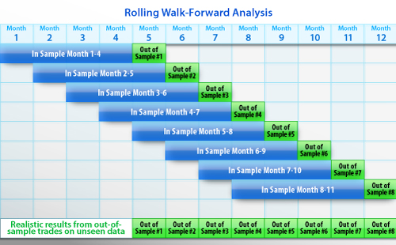

# Introduction

## Motivation

- Provide a synopsis of walk-forward analysis technique

# Walk-Forward Analysis

## Walk-Forward Analysis

Instead of making one backtest from a given historical data set, make several smaller backtests, each containing an IS and OOS period, for better comparison.  The following figure illustrates making eight WFA backtests from one dataset. 

* This example uses a _rolling_ configuration that overlays backtests and moves the start point forward by one period.
* An alternative is an _anchor_ starting point always pinned to the first period, making each backtest IS period successively longer.  In this case the OOS period could be either a fixed brief duration or a successively shorter period chosen to consume all of the history.  

## Walk-Forward Analysis

## Walk-Forward Analysis

* For some number of slices of the historical timeframe, the slices could be exclusive or non-exclusive.  
* The OOS periods, pasted together, could represent a full OOS simulation but are unlikely to represent such a simulation owing to memory (initial conditions) across boundaries
* For long-lookback algorithms (e.g. 12-month SMA) it is necessary to have long OOS periods merely to obtain one sample for consideration

# Recommendation

## Recommendation

* Where practicable given a reasonable length of historical exchange data, apply WFA to collect a set of OOS tests.  
* Demonstrate that these OOS performance results are robust across time periods and meet expectations of IS parameter selections.  
